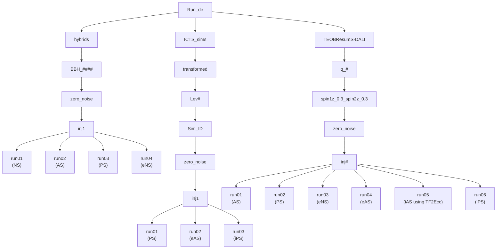

# eccentric_pe

## Injections:
- Run_dir on Sonic: `/mnt/pfs/divyajyoti/eccentric_population/eccentric_pe/injections`
- Run_dir for ICTS Sims on Sonic: `/mnt/pfs/divyajyoti/eccentric_population/eccentric_pe/injections/ICTS_sims/transformed`

## Directory structure:
- Key: 
  - "#" means a number
  - NS: Non-Spinning IMR circular recovery using IMRPhenomXAS
  - AS: Aligned-Spin IMR circular recovery using IMRPhenomXAS
  - PS: Precessing-Spin IMR circular recovery using IMRPhenomXP
  - eNS: eccentric NS inspiral recovery using TaylorF2Ecc
  - eAS: eccentric AS inspiral recovery using TaylorF2Ecc
  - iAS: inspiral Aligned-Spin circular recovery
  - iPS: inspiral Precessing-Spin circular recovery using IMRPhenomXP

### Inj numbers for TEOBResumS-DALI injections
| inj | eccentricity value |
|-----|--------------------|
| 1 | 0 |
| 2 | 0.05 |
| 3 | 0.1 |
| 4 | 0.15 |
| 5 | 0.2 |
| 6 | 0.25 |
| 7 | 0.3 |
| 8 | 0.35 |
